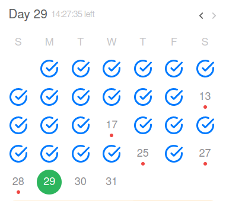

Title: Everything I read and watch January
Date: 2024-01-29
Tags: #study-topics, #algorithms, #distribute-systems
author: matheusfrancisco

## January study topics

This month I was looking for improve some knowledge about Algorithms, Data Structure and Distribute Systems, also start put my foot in some fields again as calculus (limits) and linear algebra to get a path to the beautiful world of AI and LLM.

So I Started doing so far for Algorithms and Data Structure, this is not a recommendation it is what I'm doing here is All problem I solved from leetcode https://github.com/matheusfrancisco/playground.programming but so far it was 

Also I start watch the course from MIT https://ocw.mit.edu/courses/6-006-introduction-to-algorithms-fall-2011/ from this I may post something or create some repository but my main focus it will be on the classes and maybe do some exercises.

About distribute system it is the same thing I started a course from MIT https://pdos.csail.mit.edu/6.824/schedule.html also it will be something I may create some post.

and I start learning more about LLM and AI but I felt I needed more about math to understand better so I'm finish a calculus and linear algebra course this one I don´t know how ca I post but may add some things.

att Chico

chico@matheusfrancisco.com.br
